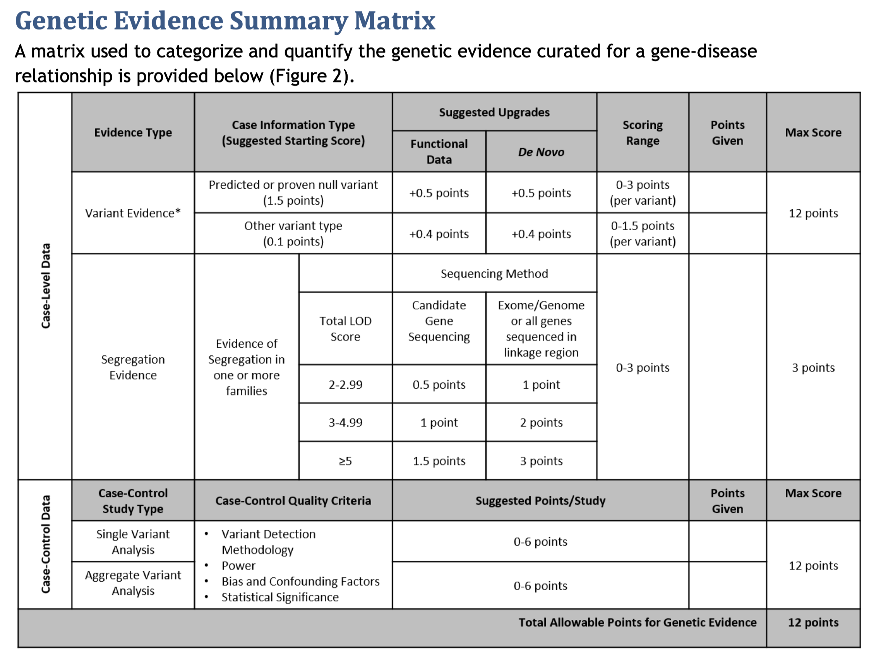

# Gene–Disease Validity Curation Demo

## What this repo shows

This repository contains a working prototype of an _LLM‑powered multi‑agent pipeline_ that automates large parts of the [ClinGen gene–disease validity curation workflow](https://clinicalgenome.org/site/assets/files/9851/gene-disease_validity_standard_operating_procedures-_version_11_docx.pdf) gene–disease validity curation workflow.

<!-- 

 -->

  

  

Our system

1.  **Search PubMed** for a _gene × disease_ query.
2.  **Fetch abstracts** for the top _N_ papers.
3.  **Dispatch four specialist agents** (Variant, Functional, Cohort, Segregation) that independently extract structured evidence from each abstract.
4.  **Aggregate & weight** the evidence to compute per‑category scores and a provisional clinical‑validity classification ("Limited", "Moderate", "Strong", etc.).

---

## Why gene curation is perfect for an LLM multi‑agent design

| Manual curation | How the agents help |
| --- | --- |
| Dozens of papers must be read and scored by hand | Agents run focussed extraction passes in parallel |
| Evidence types are heterogeneous (variants vs. family segregation vs. functional assays) | Domain‑specific prompts + Pydantic parsers keep the JSON schemas disjoint yet composable |

---

## Manual effort saved

A trained curator typically needs hours to bring a single gene–disease pair to “classification‑ready”:

*   literature triage
*   per‑patient variant assessment
*   segregation analysis
*   cross‑checking public databases

---

## Code / component map

| Path | Responsibility |
| --- | --- |
| `pubmed.py` | Async PubMed search & abstract fetch |
| `agents.py` etc. | Four specialist extractor classes (prompt + parser + `analyze`) |
| `orchestrator.py` | Fan‑out / gather helper that runs the specialists per PMID |
| `/graph` | Builds the StateGraph (`search → fetch → extract → score → classify`) |
| `run_curation.py` | CLI entry‑point – `python run_curation.py BRCA1 "breast cancer"` |

---

## Extending the demo

1.  **Router node** – let an LLM decide which evidence agents to run per abstract.
2.  **Enrichment nodes** – call ClinVar & gnomAD to annotate extracted variants before scoring.
3.  **Critic loop** – add a validator agent that asks a second LLM to sanity‑check each JSON payload.
4.  **Vector memory** – store per‑abstract summaries in a local Chroma DB for cross‑gene reuse.

---

## Quick‑start

